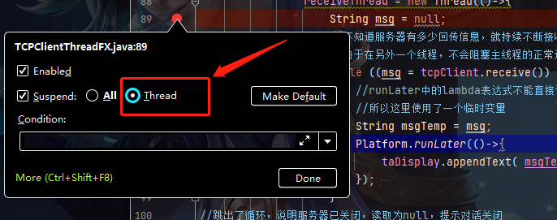

# Searched blogs
1. [javaFX在非FX线程中更新UI](https://www.cnblogs.com/ssh2/p/7765199.html) 

# Debug 多线程注意

1. 

2. 如果有多个线程。
   
比如   @file:TCPClientThreadFX.java 有个主线程和my_receiveThread

那么对每个线程都要设置 1. “**Thread**”

